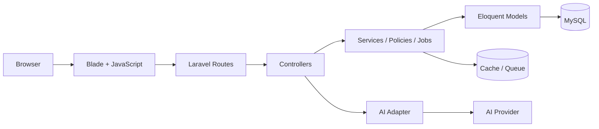

<div align="center">

# 📚 Comicx

### Nền tảng đọc Manga · Manhwa · Manhua với Reader nâng cao và gợi ý truyện bằng AI

<p>
  
  
  
  
  
</p>

<p>
  <a href="https://github.com/hunglc721/Web-truy-n/actions/workflows/laravel-tests.yml">
    
  </a>
</p>

**Dự án cá nhân Backend-focused của [hunglc721](https://github.com/hunglc721)**  
Xây dựng theo hướng một sản phẩm thực tế: có phân quyền, Reader chuyên sâu, AI recommendation, realtime notification, queue/cache, kiểm thử tự động và CI.

</div>

---

## ✨ Tổng quan

**Comicx** là website đọc truyện tranh trực tuyến được xây dựng bằng **Laravel + Blade**, phục vụ 3 nhóm chính:

- **Guest**: khám phá và đọc truyện miễn phí.
- **Member**: lưu tiến độ, quản lý tủ truyện, tương tác và nhận thông báo.
- **Admin / Staff**: quản trị nội dung, người dùng, phân quyền, báo cáo và vận hành hệ thống.

> Toàn bộ chapter đã phát hành đều có thể đọc **miễn phí**. Dự án không dùng Coin, Wallet hay VIP để khóa nội dung.

### Điểm nổi bật

| Module | Điểm chính |
|---|---|
| 🤖 **AI Recommendation Chatbot** | Hiểu yêu cầu tự nhiên, giữ ngữ cảnh hội thoại, chỉ gợi ý truyện thật trong DB, có quota + fallback |
| 📖 **Advanced Reader** | Preset khuyến nghị, quick settings, advanced settings, nhiều mode đọc, lưu cấu hình giữa các chapter |
| 📚 **Comic Management** | Quản lý truyện, chapter, metadata, ảnh bìa, lịch phát hành, tác giả, thể loại, tag |
| 🔔 **Realtime Notification** | SSE + fallback polling, notification center, admin broadcast |
| 🛡️ **Security & RBAC** | Auth, 2FA, permission middleware, validation, rate limiting, upload protection |
| ⚡ **Performance** | Cache, queue, optimized queries, image variants, N+1 prevention |
| 🧪 **Quality** | Laravel tests + Playwright E2E + GitHub Actions CI |

---

## 🧱 Kiến trúc hệ thống



Ứng dụng chính nằm tại:

```text
laravel-blade/
```

Browser E2E tests:

```text
e2e/
```

---

## 🤖 AI Recommendation Chatbot

Chatbot không để AI tự bịa truyện rồi trả lời cho có vẻ thông minh. Kiến trúc được tách rõ:

```text
User message
    ↓
AI Intent Parser
    ↓
Conversation State
    ↓
RecommendationService
    ↓
MySQL / Taxonomy / Scoring
    ↓
Comic thật trong hệ thống
    ↓
Conversational Response
```

### Chatbot có thể

- hiểu yêu cầu bằng tiếng Việt tự nhiên;
- nhận biết genre, theme, setting, tính cách nhân vật, tone, status và điều kiện loại trừ;
- ghi nhớ preference qua nhiều tin nhắn;
- xử lý các câu như:
  - “fantasy main yếu rồi mạnh”;
  - “không harem”;
  - “thôi bỏ dungeon”;
  - “cho truyện hoàn thành rồi”;
- hỏi thêm khi thông tin chưa đủ;
- trả **3–5 truyện thật** từ database;
- giải thích ngắn vì sao truyện phù hợp;
- giữ guardrail để AI không tự tạo comic ID, slug, title hay score.

### Quota & fallback

- quota theo user / guest session / IP;
- tạo conversation mới không reset ngân sách AI;
- quick reply không cần gọi AI;
- cache kết quả parse;
- timeout / 429 / 5xx / JSON lỗi đều có fallback;
- rule-based parser tiếp quản khi AI unavailable;
- automated tests dùng fake/mock provider, không đốt quota thật.

Cấu hình qua `.env`:

```env
AI_ENABLED=true
AI_CONVERSATIONAL_RESPONSE=true
AI_PROVIDER=openai_compatible
AI_API_KEY=
AI_MODEL=
AI_BASE_URL=
AI_TIMEOUT=15
AI_RETRY_TIMES=1
AI_MAX_CALLS=10
AI_RATE_LIMIT_DECAY=60
AI_PARSE_CACHE_TTL=600
```

---

## 📖 Reader nâng cao

Reader được xây dựng để user có thể **mở chapter và đọc ngay**, không phải cấu hình cả “buồng lái máy bay” trước khi lật trang đầu tiên.

### ⭐ Preset mặc định: Khuyến nghị

User mới được áp dụng cấu hình tối ưu sẵn.

Nếu user thay đổi setting:

```text
⭐ Khuyến nghị
      ↓
User chỉnh một option
      ↓
⚙ Tùy chỉnh
```

Có thể quay lại preset bằng **“Dùng cài đặt khuyến nghị”**.

### Quick Settings

Chỉ giữ những thứ thường dùng khi đang đọc:

- chế độ đọc;
- hướng đọc khi phù hợp;
- vừa chiều rộng / vừa chiều cao;
- khoảng cách trang;
- độ sáng / giảm chói;
- mở **Cài đặt nâng cao**.

### Advanced Settings

Được chia riêng theo nhóm:

- **Bố cục**
- **Hiển thị ảnh**
- **Phím tắt**
- **Hành vi**
- **Khác**

Reader settings được giữ khi:

- reload;
- sang chapter tiếp;
- quay chapter trước;
- mở lại Reader.

Ngoài ra hệ thống còn có:

- reader image variants;
- lazy loading;
- reader performance tests;
- hỗ trợ desktop + mobile;
- reader settings E2E.

Tài liệu chi tiết về image pipeline: [docs/READER_IMAGES.md](docs/READER_IMAGES.md).

---

## 👤 Guest / Member / Admin

### 👀 Guest

Không cần đăng nhập vẫn có thể:

- xem trang chủ và danh sách truyện;
- duyệt thể loại, tag, tác giả và nhóm dịch;
- xem lịch phát hành;
- tìm kiếm truyện;
- tìm kiếm tiếng Việt không dấu;
- xem chi tiết truyện;
- đọc toàn bộ chapter đã phát hành;
- sử dụng Reader;
- sử dụng chatbot gợi ý truyện;
- xem bình luận và đánh giá;
- gửi liên hệ / báo cáo phù hợp.

### 👤 Member

Sau khi đăng nhập:

- quản lý **Tủ Truyện**;
- lưu lịch sử đọc;
- lưu tiến độ chapter;
- xác định chapter chưa đọc;
- tiếp tục đọc đúng vị trí;
- like và rating;
- viết / trả lời bình luận;
- tạo danh sách đọc;
- xem thống kê cá nhân;
- nhận notification chapter mới;
- nhận thông báo từ Admin;
- sử dụng Notification Center.

### 🛡️ Admin / Staff

Khu vực `/admin` hỗ trợ:

- dashboard và analytics;
- CRUD truyện;
- quản lý chapter;
- upload ảnh chapter;
- quản lý thể loại / tag / tác giả;
- quản lý banner và lịch phát hành;
- quản lý user;
- khóa / mở khóa tài khoản;
- RBAC và permission;
- kiểm duyệt bình luận;
- xử lý báo cáo;
- xử lý yêu cầu đăng truyện;
- audit log;
- cấu hình website;
- đổi logo / favicon / branding;
- maintenance mode;
- admin notification / broadcast.

> Authorization được kiểm tra ở Backend bằng middleware / permission. UI không được dùng thay cho kiểm tra quyền.

---

## 🔔 Realtime Notification

Comicx sử dụng **Server-Sent Events (SSE)** cho notification realtime.

```text
Server tạo notification
        ↓
SSE stream
        ↓
Browser nhận snapshot
        ↓
Badge cập nhật
        ↓
Dropdown refresh + Toast
```

Có:

- heartbeat;
- EventSource reconnect;
- fallback polling khi SSE lỗi liên tiếp;
- notification center;
- admin broadcast;
- browser E2E kiểm tra realtime giữa nhiều role.

---

## 📚 Tủ Truyện & Reading Progress

Tủ Truyện không chỉ là bookmark.

Hệ thống theo dõi:

- số chapter chưa đọc;
- trạng thái đã đọc hết;
- chapter tiếp theo nên đọc;
- `last_read_chapter_id`;
- vị trí đọc;
- chapter tương lai không bị tính là chưa đọc;
- đọc lại chapter cũ không làm lùi tiến độ;
- batch query để tránh N+1.

---

## 🔎 Search & Recommendation

### Search

Hỗ trợ:

- title;
- partial / contains;
- author;
- genre;
- country;
- exclude genre;
- sorting;
- tiếng Việt không dấu.

Ví dụ:

```text
thang cap
```

vẫn có thể tìm:

```text
Tôi Thăng Cấp Một Mình
```

### Recommendation Engine

Recommendation không phụ thuộc hoàn toàn vào AI.

Backend có thể dùng:

- genre;
- taxonomy tags;
- theme;
- setting;
- character traits;
- tone;
- relationship;
- status;
- explicit exclude;
- lịch sử / hành vi người dùng khi phù hợp.

AI chỉ đóng vai trò **hiểu ý người dùng và diễn đạt phản hồi**, còn truyện được chọn bởi backend.

---

## ⚡ Performance & Backend Engineering

Một số kỹ thuật đang được áp dụng:

### Cache

- cache dữ liệu đọc nhiều;
- cache recommendation parsing;
- invalidation khi dữ liệu liên quan thay đổi.

### Queue / Background Jobs

- xử lý ảnh;
- notification;
- tác vụ nền;
- workflow upload dài hạn.

### Query Optimization

- eager loading;
- batch query;
- SQL ranking cho recommendation;
- tránh hydrate toàn bộ thư viện chỉ để lấy top vài kết quả;
- composite indexes cho truy vấn phổ biến.

### Reader Image Pipeline

- image variants;
- responsive image loading;
- queue/backfill;
- performance-focused delivery.

---

## 🔐 Authentication & Security

Hệ thống hiện có:

- đăng ký / đăng nhập / đăng xuất;
- email verification;
- forgot/reset password;
- Two-Factor Authentication;
- recovery code;
- session management;
- logout thiết bị khác;
- ban check;
- RBAC;
- permission middleware;
- CSRF protection;
- validation;
- rate limiting;
- secure image upload;
- anti-spam;
- URL safety checks;
- guardrail cho AI input/output;
- quota AI theo server identity;
- không expose API key ra frontend.

---

## 🧪 Testing & CI

Dự án sử dụng nhiều tầng kiểm thử thay vì chỉ “chạy được trên máy em”.

### Laravel Test Suite

```bash
cd laravel-blade
php artisan test
```

Bao gồm:

- Unit tests;
- Feature tests;
- auth / security;
- permission;
- search;
- recommendation;
- chatbot;
- Reader;
- Library;
- notification;
- rate limiting;
- regression.

### Critical User Journey

```bash
php artisan test tests/Feature/CriticalUserJourneyTest.php --stop-on-failure
```

### Playwright E2E

```bash
cd e2e
npm install
npx playwright install chromium
npm test
```

CI chạy trên:

- Desktop Chromium;
- Mobile Chromium;
- chatbot E2E với fixture riêng;
- notification lifecycle;
- Reader flows;
- login / Library / Search;
- responsive behavior.

### GitHub Actions

Pipeline chính:

```text
Checkout
   ↓
PHP 8.3 + Composer
   ↓
Validate Routes
   ↓
Critical Smoke Tests
   ↓
Full Laravel Regression
   ↓
Prepare isolated E2E DB
   ↓
Start Laravel Server
   ↓
Playwright Desktop + Mobile
   ↓
Chatbot E2E
```

Workflow:

```text
.github/workflows/laravel-tests.yml
```

---

## 🛠️ Tech Stack

| Layer | Công nghệ |
|---|---|
| Backend | PHP 8.3+, Laravel 11, MVC, Eloquent ORM |
| Database | MySQL, SQLite cho test/CI |
| Frontend | Blade, HTML5, CSS3, JavaScript, Fetch/AJAX |
| Realtime | Server-Sent Events |
| Async | Laravel Queue, Scheduler |
| Performance | Cache, optimized queries, image variants |
| AI | OpenAI-compatible adapter + rule-based fallback |
| Testing | PHPUnit / Laravel Test Suite, Playwright |
| DevOps | Git, GitHub, GitHub Actions |

---

## 🚀 Cài đặt và chạy dự án

> Các lệnh dưới đây dành cho môi trường dev mới. Không dùng lệnh reset database trên môi trường đang chứa dữ liệu thật.

### 1. Cài Backend

```bash
git clone https://github.com/hunglc721/Web-truy-n.git
cd Web-truy-n/laravel-blade

composer install
cp .env.example .env
php artisan key:generate
```

Trên Windows PowerShell nếu không dùng được `cp`:

```powershell
Copy-Item .env.example .env
```

### 2. Cấu hình database

Ví dụ:

```env
DB_CONNECTION=mysql
DB_HOST=127.0.0.1
DB_PORT=3306
DB_DATABASE=web_truyen
DB_USERNAME=root
DB_PASSWORD=

CACHE_STORE=file
QUEUE_CONNECTION=database
```

### 3. Khởi tạo database

```bash
php artisan migrate --seed
php artisan storage:link
```

### 4. Chạy ứng dụng

```bash
php artisan serve
```

Mặc định:

```text
http://127.0.0.1:8000
```

### 5. Queue Worker

```bash
php artisan queue:work
```

### 6. Scheduler

```bash
php artisan schedule:work
```

---

## 🔑 Tài khoản seed

| Vai trò | Email | Mật khẩu |
|---|---|---|
| Admin | `admin@webcomics.com` | `12345678` |
| Member | `user@webcomics.com` | `12345678` |

Seeder còn tạo một số role/user mẫu phục vụ phát triển và kiểm thử.

---

## 📁 Cấu trúc chính

```text
Web-truy-n/
├── laravel-blade/
│   ├── app/
│   │   ├── Http/
│   │   ├── Models/
│   │   ├── Services/
│   │   ├── Jobs/
│   │   └── Policies/
│   ├── database/
│   ├── resources/
│   ├── routes/
│   ├── tests/
│   └── public/
├── e2e/
├── docs/
└── .github/workflows/
```

---

<details>
<summary><strong>🌐 Một số route chính</strong></summary>

### Public

```text
/                                  Trang chủ
/genres                            Thể loại
/schedule                          Lịch phát hành
/originals                         Originals
/truyen/{slug}                     Chi tiết truyện
/truyen/{comicSlug}/{chapterSlug}  Reader
/about                             Giới thiệu
/contact                           Liên hệ
```

### Member

```text
/user
/user/library
/user/history
/user/likes
/user/comments
/user/ratings
/user/notifications
```

### Admin

```text
/admin
/admin/analytics
/admin/comics
/admin/chapters
/admin/genres
/admin/tags
/admin/authors
/admin/users
/admin/comments
/admin/reports
/admin/schedules
/admin/banners
/admin/notifications
/admin/logs
/admin/permissions
/admin/settings
```

</details>

---

## 📚 Tài liệu kỹ thuật

- [Architecture](docs/ARCHITECTURE.md)
- [Reader Images](docs/READER_IMAGES.md)
- [Phase Status](docs/PHASE_STATUS.md)
- [GitHub Actions Workflow](.github/workflows/laravel-tests.yml)
- [Playwright E2E](e2e/tests/)

---

## 🎯 Mục tiêu dự án

Dự án tập trung thể hiện khả năng xây dựng một hệ thống web Backend hoàn chỉnh:

- thiết kế database;
- xử lý business logic;
- tổ chức service layer;
- authentication / authorization;
- cache / queue / scheduler;
- tích hợp AI có guardrail;
- realtime;
- performance optimization;
- automated testing;
- CI;
- kết nối Backend với UI thực tế.

Không chỉ dừng ở CRUD, mục tiêu là xây dựng một sản phẩm có thể tiếp tục mở rộng và vận hành.

---

<div align="center">

### ⭐ Repository

**[github.com/hunglc721/Web-truy-n](https://github.com/hunglc721/Web-truy-n)**

Nếu repo hữu ích, có thể để lại một ⭐. Con số thì vô tri, nhưng nhìn vẫn vui.

</div>
